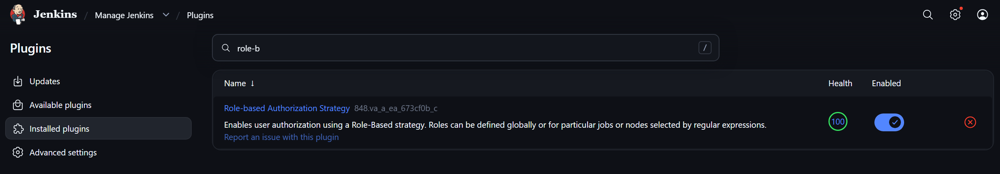
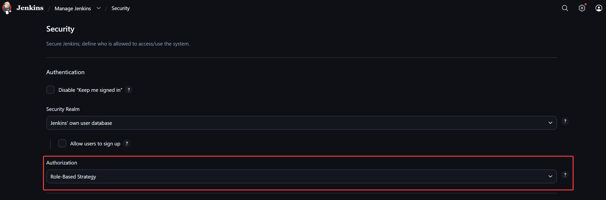
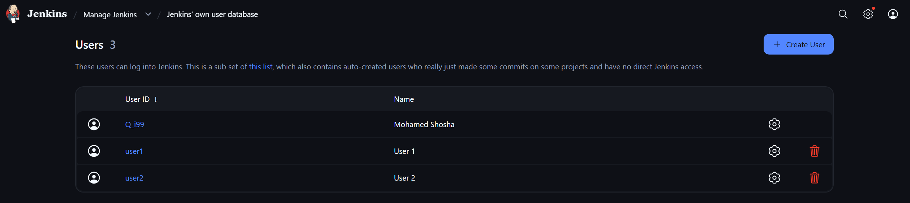
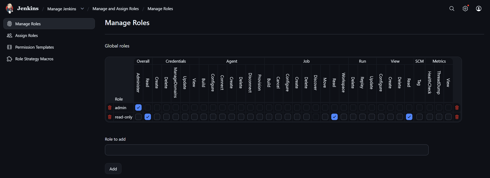
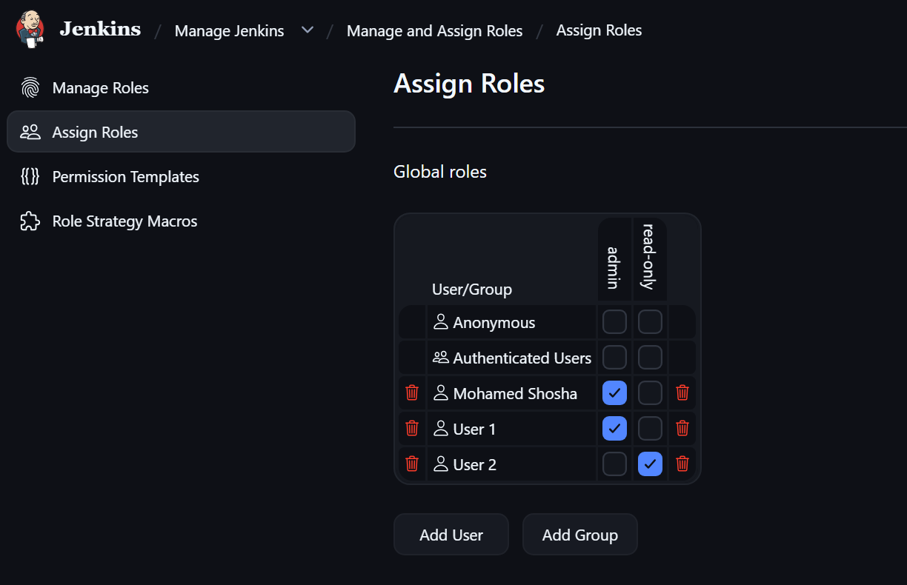


# Jenkins Lab 1:  Role-based Authorization

This lab demonstrates the implementation of Role-Based Access Control (RBAC) within a Jenkins environment. The goal is to move away from "Full Control" settings and implement a principle of least privilege by creating specific roles for different user types.

----------

## Tasks Overview

- Create user1 and user2.
- Assign admin role for user1 & read-only role for user2.
---

## Steps and Screenshots
### 1. Install the Required Plugin `Role-based Authorization Strategy`
To install the `Role-based Authorization Strategy` plugin:
 1. Navigate to `Manage Jenkins` > `Plugins` > `Available Plugins`
 2. Search for `Role-based Authorization Strategy`
 3. Select it and install.

---
### 2. Enable Role-Based Management
To enable role-based management, we need to change the authorization strategy:
 1. Navigate to `Manage Jenkins` > `Security`
 2. Under `Authorization` select `Role-Based Strategy`

---
### 3. Users Creation
Two users were created via `Manage Jenkins` > `Users` > `Create User`:
- user1 for admin tasks.
- user2 for read-only tasks.

---
### 4. Roles Definition
Defined the `admin` and `read-only` global roles in `Manage Jenkins` > `Manage and Assign Roles` > `Manage Roles`

---
### 5. Roles Assignment
Users were assigned their respective roles in `Manage Jenkins` > `Manage and Assign Roles` > `Assign Roles`

