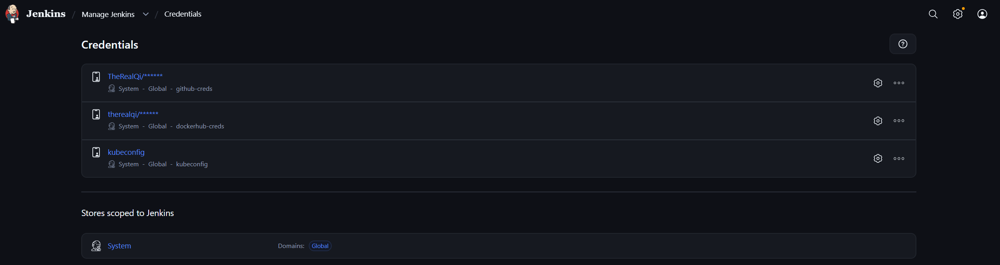
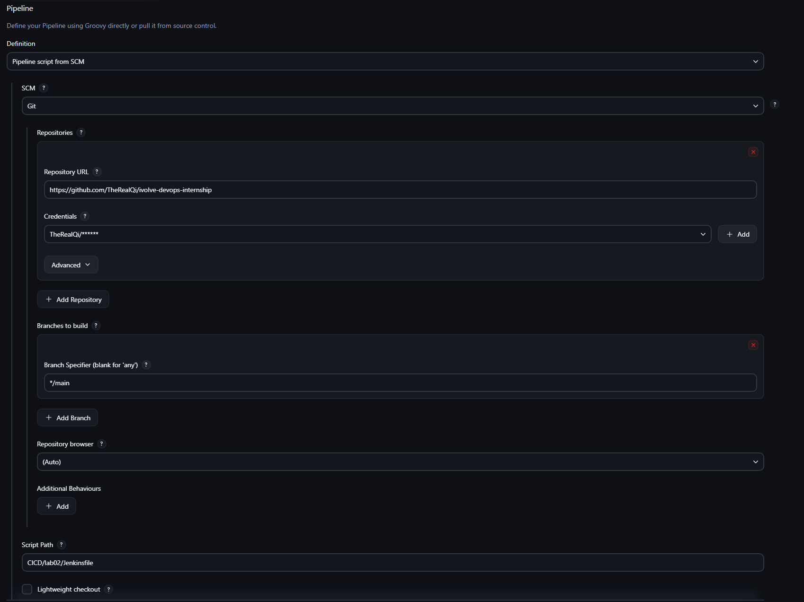
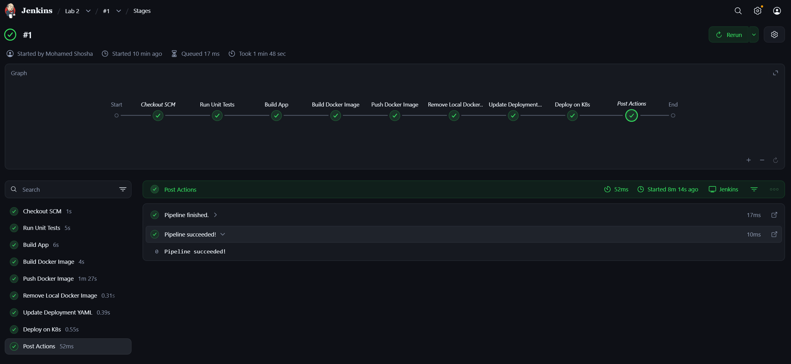

# Jenkins Lab 2:   Jenkins Pipeline for Application Deployment

This lab demonstrates how to build a complete CI/CD pipeline using Jenkins to automate application testing, building, containerization, and deployment to a Kubernetes cluster.  

The pipeline follows best practices by integrating unit testing, Docker image management, and Kubernetes deployment, along with proper post-build actions.

----------

## Tasks Overview

 - Clone source code and Dockerfile from: https://github.com/Ibrahim-Adel15/Jenkins_App.git
 - Create a pipeline that automates the following processes:
	- Run Unit Test 	Build App
    - Build Docker image from Dockerfile in GitHub.
	- Push image to Docker hub.
	- Delete image locally.
	- Edit new image in deployment.yaml file.
	- Deploy to k8s cluster.
- Set pipeline post action (always, success, failure) 
---

## Steps and Screenshots
### 1. Configure Credentials


---
### 2. Install Docker, kubectl, and Maven on the Jenkins Agent
-   Install required tools on the Jenkins agent.
-   Ensure Jenkins can run Docker commands, access Kubernetes, and build Maven projects on the agent.
---
### 3. Define Jenkinsfile

```groovy 
pipeline {
    agent any
    environment {
        IMAGE_REPO = "therealqi"
        IMAGE_NAME = "jenkins-lab02"
        IMAGE_TAG = "${BUILD_NUMBER}"
        WORKDIR = "CICD/lab02"
    }
    stages {
        stage('Run Unit Tests') {
            steps {
                dir(env.WORKDIR) {
                    sh 'mvn test'
                }
            }
        }
        stage('Build App') {
            steps {
                dir(env.WORKDIR) {
                    sh 'mvn clean package -DskipTests'
                }
            }
        }
        stage('Build Docker Image') {
            steps {
                dir(env.WORKDIR) {
                    sh 'docker build -t ${IMAGE_REPO}/${IMAGE_NAME}:${IMAGE_TAG} .'
                }
            }
        }
        stage('Push Docker Image') {
            steps {
                withCredentials([usernamePassword(credentialsId: 'dockerhub-creds', usernameVariable: 'DOCKERHUB_USER', passwordVariable: 'DOCKERHUB_PASS')]) {
                    sh '''
                    echo ${DOCKERHUB_PASS} | docker login -u ${DOCKERHUB_USER} --password-stdin
                    docker push ${IMAGE_REPO}/${IMAGE_NAME}:${IMAGE_TAG}
                '''
                }
            }
        }
        stage('Remove Local Docker Image') {
            steps {
                sh 'docker rmi ${IMAGE_REPO}/${IMAGE_NAME}:${IMAGE_TAG} || true'
            }
        }
        stage('Update Deployment YAML') {
            steps {
                dir(env.WORKDIR) {
                    sh '''
                  sed -i "s|image:.*|image: ${IMAGE_REPO}/${IMAGE_NAME}:${IMAGE_TAG}|g" app-deployment.yaml
                '''
                }
            }
        }
        stage('Deploy on K8s') {
            steps {
                withCredentials([file(credentialsId: 'kubeconfig', variable: 'KUBECONFIG_FILE')]) {
                    dir(env.WORKDIR) {
                        sh '''
                        export KUBECONFIG=$KUBECONFIG_FILE
                        kubectl apply -f app-deployment.yaml
                        '''
                    }
                }
            }
        }
    }
    post {
        always {
            echo "Pipeline finished."
        }
        success {
            echo "Pipeline succeeded!"
        }
        failure {
            echo "Pipeline failed!"
        }
    }
}
```

---
### 4. Create Pipeline
- In Jenkins, create a new Pipeline Job.
- Connect the pipeline to the Git repository containing the `Jenkinsfile`


---
### 5. Run Pipeline

