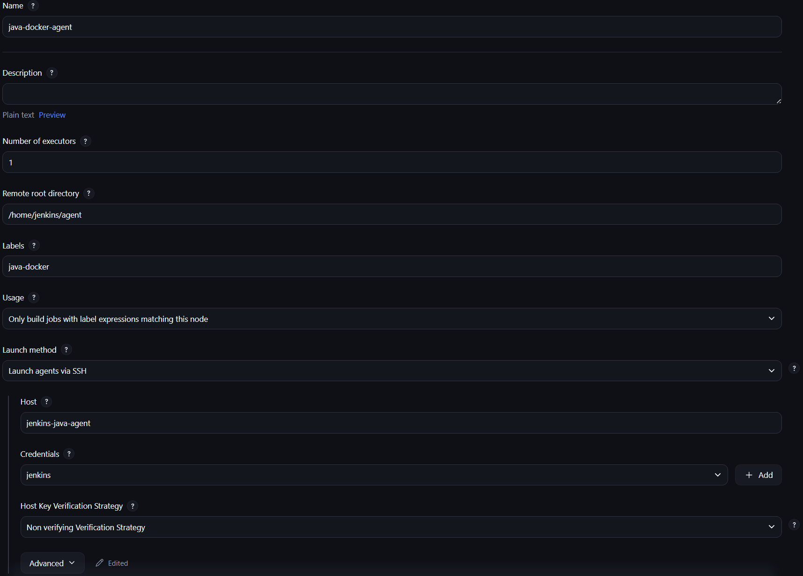
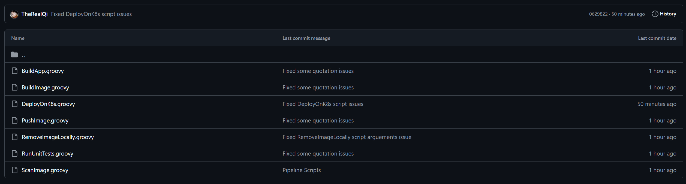
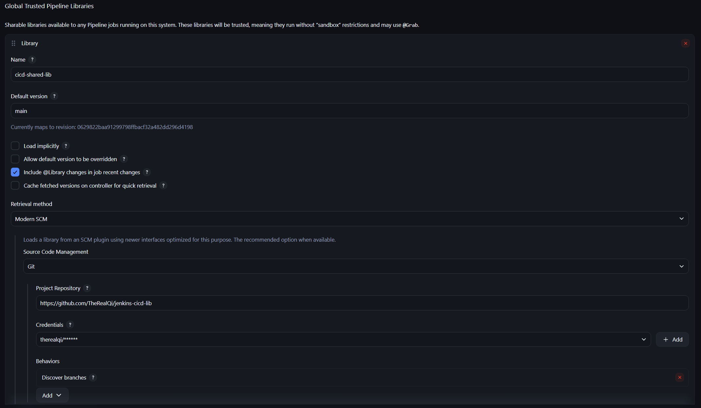
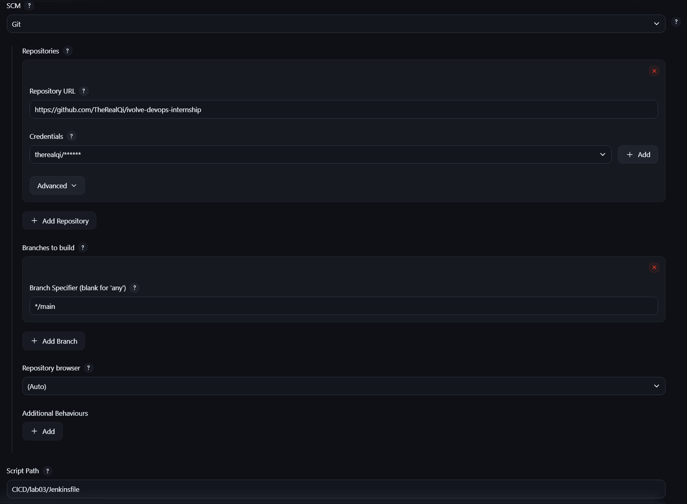
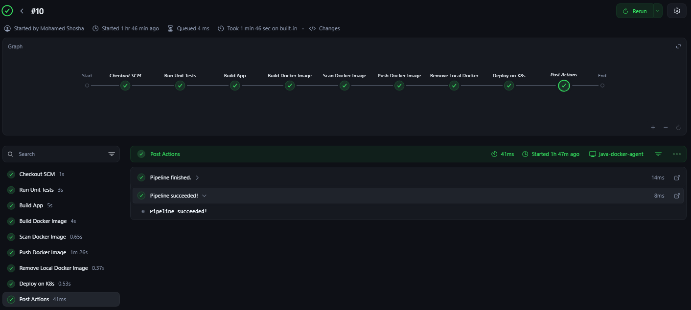

# Jenkins Lab 3: CI/CD Pipeline Implementation with Jenkins Agents and Shared Libraries

This lab demonstrates how to build a complete CI/CD pipeline using Jenkins Agents and Shared Libraries to automate application testing, building, image scanning, containerization, and deployment to a Kubernetes cluster.  

----------

## Tasks Overview

 - Clone source code and Dockerfile from: https://github.com/Ibrahim-Adel15/Jenkins_App.git
 - Create a pipeline with the following stages:
	- RunUnitTest
    - BuildApp
	- BuildImage
	- ScanImage
	- PushImage
	- RemoveImageLocally
	- DeployOnK8s
- Use shared library for these tasks and demonstrate its usage in different pipelines.
- Configure Jenkins slave to run the pipeline.
---
## Requisites 
-   Jenkins Controller
-   Jenkins Agent:
	- With:
	    -   Docker
	    -   kubectl
	    -   Maven
	    -   Trivy
    - Can communicate with the Kubernetes cluster via a Bearer Token.
- Jenkins Controller Public Key copied to the Jenkins Agent
- Docker Setup: 
	- https://github.com/TheRealQi/jenkins-docker
---
## Steps and Screenshots
### 1. Setup Jenkins Agent
To setup a new node (agent):
 - Navigate to `Manage Jenkins` > `Nodes` > `New Node`
 
---
### 2. Create and Setup Jenkins Shared Library
#### 2.1. Shared Library Required Scripts

#### 2.2. Jenkins Setup


---
### 3. Define Jenkinsfile
```groovy 
@Library('cicd-shared-lib') _
pipeline {
    agent { label 'java-docker' }
    environment {
        IMAGE_REPO = "therealqi"
        IMAGE_NAME = "jenkins-lab03"
        IMAGE_TAG = "${BUILD_NUMBER}"
        WORKDIR = "CICD/lab03"
    }
    stages {
        stage('Run Unit Tests') {
            steps {
                RunUnitTests(env.WORKDIR)
            }
        }
        stage('Build App') {
            steps {
                BuildApp(env.WORKDIR)
            }
        }
        stage('Build Docker Image') {
            steps {
                BuildImage(env.WORKDIR, IMAGE_REPO, IMAGE_NAME, IMAGE_TAG)
            }
        }
        stage('Scan Docker Image') {
            steps {
                ScanImage(IMAGE_REPO, IMAGE_NAME, IMAGE_TAG)
            }
        }
        stage('Push Docker Image') {
            steps {
                withCredentials([usernamePassword(credentialsId: 'dockerhub-creds', usernameVariable: 'DOCKERHUB_USER', passwordVariable: 'DOCKERHUB_PASS')]) {
                    PushImage(IMAGE_REPO, IMAGE_NAME, IMAGE_TAG)
                }
            }
        }
        stage('Remove Local Docker Image') {
            steps {
                RemoveImageLocally(IMAGE_REPO, IMAGE_NAME, IMAGE_TAG)
            }
        }
        stage('Deploy on K8s') {
            steps {
                withCredentials([
                        string(credentialsId: 'jenkins-k8s-token', variable: 'BEARER_TOKEN'),
                ]) {
                    DeployOnK8s(WORKDIR, IMAGE_REPO, IMAGE_NAME, IMAGE_TAG)
                }
            }
        }
    }
    post {
        always {
            echo "Pipeline finished."
        }
        success {
            echo "Pipeline succeeded!"
        }
        failure {
            echo "Pipeline failed!"
        }
    }
}
```
---
### 4. Create Pipeline
- In Jenkins, create a new Pipeline Job.
- Connect the pipeline to the Git repository containing the `Jenkinsfile`


---
### 5. Run Pipeline

