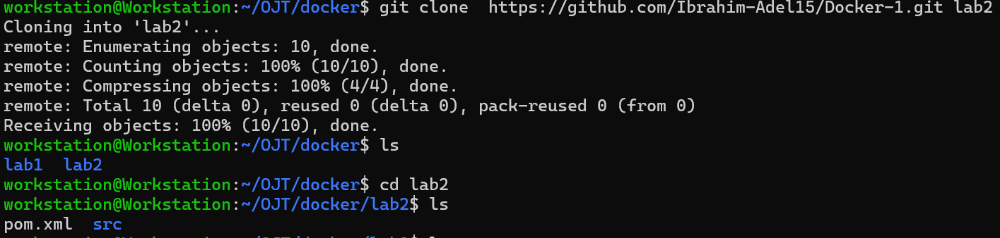

# Docker Lab 2: Run Java Spring Boot App in a Container

This lab demonstrates how to containerize a **Spring Boot** application using **Docker**, build a Docker image, run a container, and test the application.

---

## Tasks Overview

- Clone the application code: https://github.com/Ibrahim-Adel15/Docker-1.git
- Build the application
- Write a `Dockerfile`.
  - Use Java 17 base image
  - Create a working directory
  - Copy the JAR file into the container
  - Run the app using the JAR file located at `target/demo-0.0.1-SNAPSHOT.jar`
  - Expose port `8080`
- Build app2 Image (Note the image size).
- Run a container (`container2`) from the image.
- Test the application.
- Stop and delete the container.

---

## Steps and Screenshots

### 1. Clone the Application Code

```bash
git clone https://github.com/Ibrahim-Adel15/Docker-1.git
```



---
### 2. Build the Application

```bash
mvn package
```


---

### 3. Create the Dockerfile

Create a file named `Dockerfile` with the following content:

```dockerfile
FROM eclipse-temurin:17-jre-alpine

WORKDIR /app
COPY ./target/demo-0.0.1-SNAPSHOT.jar ./app.jar

EXPOSE 8080
CMD ["java", "-jar", "app.jar"]
```
---

### 3. Build the Docker image

```bash
docker build -t app2 .
```


---

### 4. Comparing Image Sizes from Docker Lab 1
When comparing Docker image sizes, we notice that prebuilding the application results in a smaller Docker image size.
```bash
docker images
```


---

### 5. Run the Container
```bash
docker run -d -p 8080:8080 --name container2 app2
```
---

### 6. Test the Application

Open a browser and navigate to:

```
http://localhost:8080
```


---

### 7. Stop and Delete the Container

```bash
docker stop container2
docker rm container2
```
