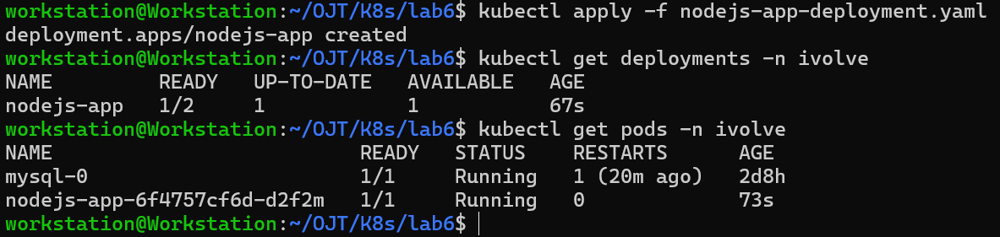
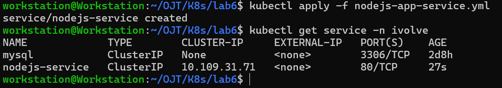
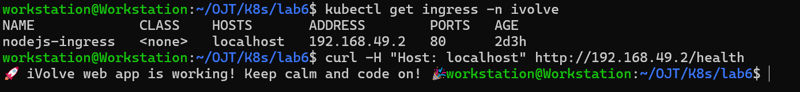

# Kubernetes Lab 6:  Node.js Application Deployment with ClusterIP service

This lab demonstrates how to work with Kubernetes `Deployment` and `ClusterIP Service`.
- Bonus: Setting up a Kubernetes `Ingress`

----------

## Tasks Overview

- Create a Deployment named nodejs-app with 2 replicas (note 1 pod only will be running). 
- Use your custom Docker image from Docker Hub.
- Add a toleration to the pod spec with key node=worker with effect NoSchedule.
- Configure a Persistent Volume Claim (PVC) and mount it to /var/lib/mysql in the StatefulSet.
- Configure pod to use the static created PV.
- Create a ClusterIP service named nodejs-service to balance traffic across all deployment replicas.
      
----------

## Steps and Screenshots

### 0. Requisites:
- The namespace `ivolve` already exists and was created in a previous Kubernetes lab (Lab 2).
- The MySQL secret and config already exist and were created in a previous Kubernetes lab (Lab 3).
- The NodeJs app image already exists and pushed to DockerHub (Docker lab 7).

----------
### 1. Define & Apply the Node.js App Deployment Manifest
Create a YAML file `nodejs-app-deployment.yaml` with the following content:
```yaml
apiVersion: apps/v1
kind: Deployment
metadata:
  name: nodejs-app
  namespace: ivolve
spec:
  selector:
    matchLabels:
      app: nodejs
  replicas: 2
  template:
    metadata:
      labels:
        app: nodejs
    spec:
      containers:
        - name: nodejs
          image: therealqi/ivolve-nodejs-app:latest
          ports:
            - containerPort: 3000
          envFrom:
          - configMapRef:
              name: mysql-config
          - secretRef:
              name: mysql-secret
          volumeMounts:
            - name: app-logs
              mountPath: /app/logs
      tolerations:
        - key: "node"
          operator: "Equal"
          value: "worker"
          effect: "NoSchedule"
      volumes:
        - name: app-logs
          persistentVolumeClaim:
            claimName: app-logs-pvc
``` 
Apply and Verify:
```bash
kubectl apply -f nodejs-app-deployment.yaml
kubectl get deployments -n ivolve
kubectl get pods -n ivolve
```


### 2. Define & Apply the ClusterIP Service Manifest
Create a YAML file `nodejs-app-service.yaml` with the following content:
```yaml
apiVersion: v1
kind: Service
metadata:
  name: nodejs-service
  namespace: ivolve
spec:
  type: ClusterIP
  selector:
    app: nodejs
  ports:
    - port: 80
      targetPort: 3000
```
Apply and Verify:
```bash
kubectl apply -f nodejs-app-service.yaml
kubectl get service -n ivolve
```

### 3. Bonus: Ingress
Create a YAML file `nodejs-app-ingress.yaml` with the following content:
```yaml
apiVersion: apps/v1
kind: Deployment
metadata:
  name: nodejs-app
  namespace: ivolve
spec:
  selector:
    matchLabels:
      app: nodejs
  replicas: 2
  template:
    metadata:
      labels:
        app: nodejs
    spec:
      containers:
        - name: nodejs
          image: therealqi/ivolve-nodejs-app:latest
          ports:
            - containerPort: 3000
          envFrom:
          - configMapRef:
              name: mysql-config
          - secretRef:
              name: mysql-secret
          volumeMounts:
            - name: app-logs
              mountPath: /app/logs
      tolerations:
        - key: "node"
          operator: "Equal"
          value: "worker"
          effect: "NoSchedule"
      volumes:
        - name: app-logs
          persistentVolumeClaim:
            claimName: app-logs-pvc
```
Apply and Verify:
```bash
kubectl apply -f nodejs-app-ingress.yaml
kubectl get ingress -n ivovle
curl -H "Host: localhost" http://192.168.49.2/health
```

