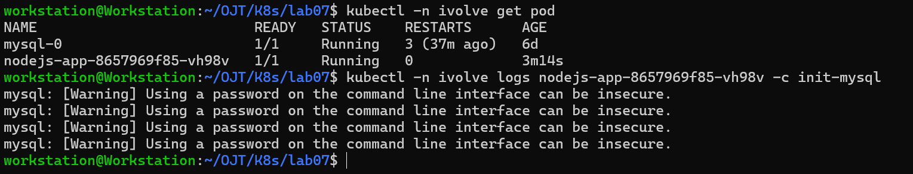
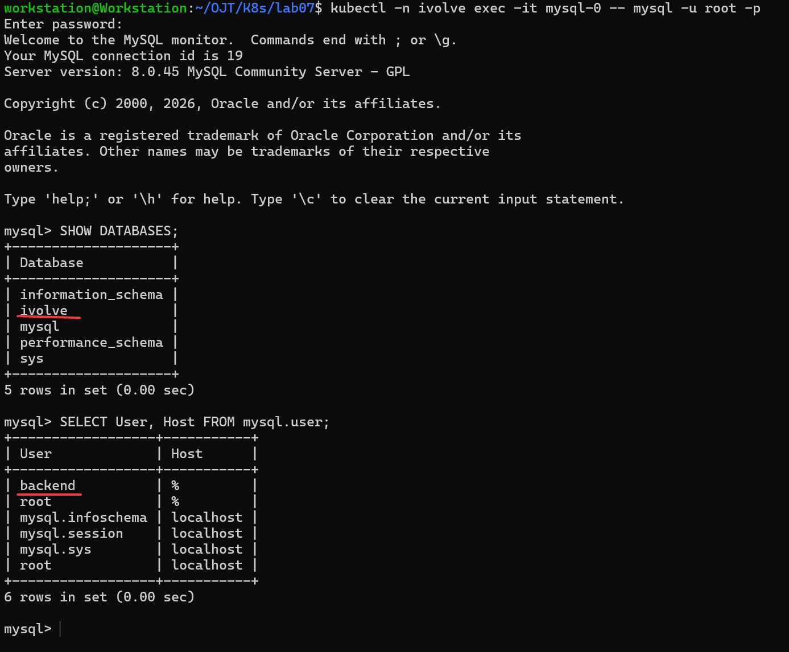

# Kubernetes Lab 7:  Kubernetes Init Container for Pre-Deployment Database Setup

This lab demonstrates how to work with Kubernetes `Init Containers`.

----------

## Tasks Overview

- Modify the existing Node.js Deployment to include an init container.
- Use your custom Docker image from Docker Hub.
- Use a MySQL client image (e.g., mysql:5.7) for the init container. 
- Pass necessary DB connection parameters using environment variables from configmap/secret.
- The init container should creates ‘ivolve’ database and a user with all access on ivolve database.
- Connect to MySQL manually to verify ivolve DB and user exist with the expected privileges.
      
----------

## Steps and Screenshots

### 0. Requisites:
- The namespace `ivolve` already exists and was created in a previous Kubernetes lab (Lab 2).
- The MySQL secret and config already exist and were created in a previous Kubernetes lab (Lab 3).
- The NodeJs app image already exists and pushed to DockerHub (Docker lab 7).
- The NodeJs deployment manifest already exists and defined in a previous Kubernetes lab (Lab 6)

----------
### 1. Modify & Apply the Node.js App Deployment Manifest
Modify the YAML file `nodejs-app-deployment.yaml` and add the following under spec to add the MySQL init container:
```yaml
      initContainers:
        - name: init-mysql
          image: mysql:8.0
          envFrom:
            - configMapRef:
                name: mysql-config
            - secretRef:
                name: mysql-secret
          command:
            - sh
            - -c
            - |
              mysql -h"$DB_HOST" -u root -p"$MYSQL_ROOT_PASSWORD" -e "CREATE DATABASE IF NOT EXISTS ivolve;"
              mysql -h"$DB_HOST" -u root -p"$MYSQL_ROOT_PASSWORD" -e "CREATE USER IF NOT EXISTS '$DB_USER'@'%' IDENTIFIED BY '$DB_PASSWORD';"
              mysql -h"$DB_HOST" -u root -p"$MYSQL_ROOT_PASSWORD" -e "GRANT ALL PRIVILEGES ON ivolve.* TO '$DB_USER'@'%';"
              mysql -h"$DB_HOST" -u root -p"$MYSQL_ROOT_PASSWORD" -e "FLUSH PRIVILEGES;"
```

Full YAML file:
```yaml
apiVersion: apps/v1
kind: Deployment
metadata:
  name: nodejs-app
  namespace: ivolve
spec:
  selector:
    matchLabels:
      app: nodejs
  replicas: 2
  template:
    metadata:
      labels:
        app: nodejs
    spec:
      initContainers:
        - name: init-mysql
          image: mysql:8.0
          envFrom:
            - configMapRef:
                name: mysql-config
            - secretRef:
                name: mysql-secret
          command:
            - sh
            - -c
            - |
              mysql -h"$DB_HOST" -u root -p"$MYSQL_ROOT_PASSWORD" -e "CREATE DATABASE IF NOT EXISTS ivolve;"
              mysql -h"$DB_HOST" -u root -p"$MYSQL_ROOT_PASSWORD" -e "CREATE USER IF NOT EXISTS '$DB_USER'@'%' IDENTIFIED BY '$DB_PASSWORD';"
              mysql -h"$DB_HOST" -u root -p"$MYSQL_ROOT_PASSWORD" -e "GRANT ALL PRIVILEGES ON ivolve.* TO '$DB_USER'@'%';"
              mysql -h"$DB_HOST" -u root -p"$MYSQL_ROOT_PASSWORD" -e "FLUSH PRIVILEGES;"
      containers:
        - name: nodejs
          image: therealqi/ivolve-nodejs-app:latest
          ports:
            - containerPort: 3000
          envFrom:
          - configMapRef:
              name: mysql-config
          - secretRef:
              name: mysql-secret
          volumeMounts:
            - name: app-logs
              mountPath: /app/logs
      tolerations:
        - key: "node"
          operator: "Equal"
          value: "worker"
          effect: "NoSchedule"
      volumes:
        - name: app-logs
          persistentVolumeClaim:
            claimName: app-logs-pvc
``` 
Apply:
```bash
kubectl apply -f nodejs-app-deployment.yaml
```

### 2. Verify the Init Container
#### 2.1 Check the Init Container Logs
To view the logs of the init container:
```bash
kubectl -n ivolve logs <nodejs-pod-name> -c init-mysql
```


#### 2.1 Verify the MySQL User and Database
Verify the `ivolve` database and `backend` user exist:
```bash
kubectl -n ivolve exec -it mysql-0 -- mysql -u root -p
SHOW DATABASES;
SELECT User, Host FROM mysql.user;
```


