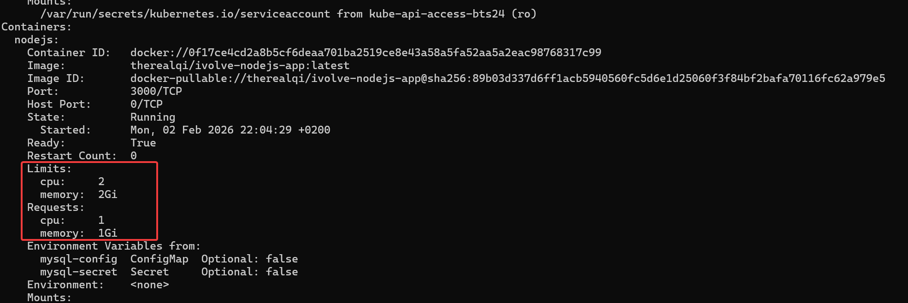
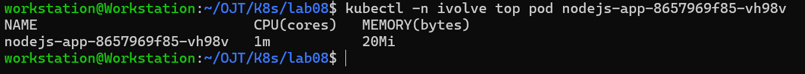

# Kubernetes Lab 8:  Pod Resource Management with CPU and Memory Requests and Limits

This lab demonstrates how to manage Kubernetes pods resources with CPU and Memory `Requests` and `Limits`.

----------

## Tasks Overview

- Update the existing Node.js Deployment to include resource requests and limits.
- Resource Requests:
	- cpu: 1 (1 vCPU) 
	- memory: 1Gi
- Resource Limits:
	- cpu: 2 (2 vCPUs)
	- memory: 2Gi
- Use kubectl describe pod to verify the applied resource requests and limits.
- Use kubectl top pod to monitor real-time resource usage. 
----------

## Steps and Screenshots

### 0. Requisites:
- The namespace `ivolve` already exists and was created in a previous Kubernetes lab (Lab 2).
- The MySQL secret and config already exist and were created in a previous Kubernetes lab (Lab 3).
- The NodeJs app image already exists and pushed to DockerHub (Docker lab 7).
- The NodeJs deployment manifest already exists and defined in a previous Kubernetes lab (Lab 6)

----------
### 1. Modify & Apply the Node.js App Deployment Manifest
Modify the YAML file `nodejs-app-deployment.yaml` and add the following under the nodejs app container to add the desired limits and requests:
```yaml
       resources:
            requests:
              cpu: "1"
              memory: "1Gi"
            limits:
              cpu: "2"
              memory: "2Gi"
```

Full YAML file:
```yaml
apiVersion: apps/v1
kind: Deployment
metadata:
  name: nodejs-app
  namespace: ivolve
spec:
  selector:
    matchLabels:
      app: nodejs
  replicas: 2
  template:
    metadata:
      labels:
        app: nodejs
    spec:
      initContainers:
        - name: init-mysql
          image: mysql:8.0
          envFrom:
            - configMapRef:
                name: mysql-config
            - secretRef:
                name: mysql-secret
          command:
            - sh
            - -c
            - |
              mysql -h"$DB_HOST" -u root -p"$MYSQL_ROOT_PASSWORD" -e "CREATE DATABASE IF NOT EXISTS ivolve;"
              mysql -h"$DB_HOST" -u root -p"$MYSQL_ROOT_PASSWORD" -e "CREATE USER IF NOT EXISTS '$DB_USER'@'%' IDENTIFIED BY '$DB_PASSWORD';"
              mysql -h"$DB_HOST" -u root -p"$MYSQL_ROOT_PASSWORD" -e "GRANT ALL PRIVILEGES ON ivolve.* TO '$DB_USER'@'%';"
              mysql -h"$DB_HOST" -u root -p"$MYSQL_ROOT_PASSWORD" -e "FLUSH PRIVILEGES;"
      containers:
        - name: nodejs
          image: therealqi/ivolve-nodejs-app:latest
          ports:
            - containerPort: 3000
          resources:
            requests:
              cpu: "1"
              memory: "1Gi"
            limits:
              cpu: "2"
              memory: "2Gi"
          envFrom:
          - configMapRef:
              name: mysql-config
          - secretRef:
              name: mysql-secret
          volumeMounts:
            - name: app-logs
              mountPath: /app/logs
      tolerations:
        - key: "node"
          operator: "Equal"
          value: "worker"
          effect: "NoSchedule"
      volumes:
        - name: app-logs
          persistentVolumeClaim:
            claimName: app-logs-pvc
``` 
Apply:
```bash
kubectl apply -f nodejs-app-deployment.yaml
```

### 2. Verify
#### 2.1 Verify Using Describe

To verify requests and limits of the pod of the nodejs app pod, describe it then look for requests and limits:
```bash
kubectl -n ivolve describe pod <nodejs-pod-name>
```


#### 2.1 Verify Using Top
To to display the resource (CPU/memory) usage of the nodejs app pod using top:
```bash
kubectl -n ivolve top pod <nodejs-pod-name>
```

