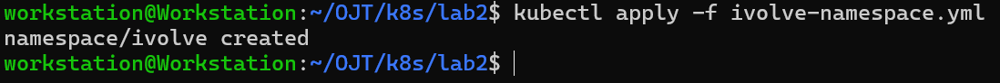

# Kubernetes Lab 2: Namespace Management and Resource Quota Enforcement

This lab demonstrates how to create a namespace in Kubernetes and enforce resource quotas to limit the number of pods that can run within that namespace.

----------

## Tasks Overview

- Create a namespace called `ivolve`.
- Apply resource quota to limit pods number to only 2 pods within the namespace.
      
----------

## Steps and Screenshots

### 1. iVolve Namespace

Create a YAML file `ivolve-namespace.yaml` with the following content:

```yaml
apiVersion: v1
kind: Namespace
metadata:
  name: ivolve
```

Apply the namespace:

`kubectl apply -f ivolve-namespace.yaml` 



Verify the namespace creation:

`kubectl get ns ivolve` 


----------

### 2. Resource Quota

Create a YAML file `ivolve-quota.yaml` with the following content:

```yaml
apiVersion: v1
kind: ResourceQuota
metadata:
  name: ivolve-ns-pods-quota
  namespace: ivolve
spec:
  hard:
    pods: "2"
``` 

Apply the resource quota:

`kubectl apply -f ivolve-quota.yaml` 


Verify the resource quota in the `ivolve` namespace:

`kubectl get quota -n ivolve`

