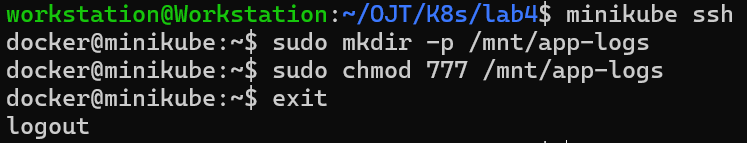
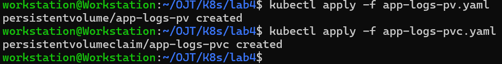
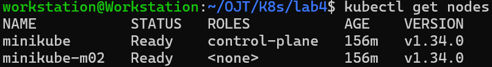
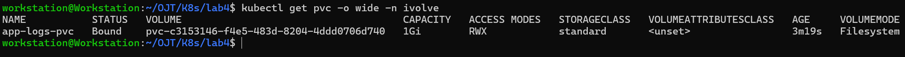

# Kubernetes Lab 4: Persistent Storage Setup for Application Logging

This lab demonstrates how to manage and setup Kubernetes `Persistent Volumes (PVs)` and `Persistent Volume Claims (PVCs)`.

----------

## Tasks Overview

- Define a Persistent Volume (PV) with the following specifications:
	- Size: 1Gi
	- Storage Type: hostPath
	- Path:  /mnt/app-logs on the node file system (/mnt/app-logs must be created on app node with 777 permission)
	- Access mode: ReadWriteMany (to allow all replicas read/write access)
	- Reclaim policy: Retain
- Define a Persistent Volume Claim (PVC) that requests 1Gi storage.
- Ensure the PVC access mode matches the PV (ReadWriteMany).
      
----------

## Steps and Screenshots

### 0. Requisites:
- Namespace `ivolve` exists, which is created in a previous Kubernetes lab.

### 1. Access & Create /mnt/app-logs on a Worker Node
To create a PV with storage type of `hostPath`, we need to create the `/mnt/app-logs` directory.

Since I am using a minikube with 2 clusters, I will be using it to SSH into my worker node `minikube-m02`:
```bash
minikube node list
minikube ssh -n minikube-m02
```
Create the `/mnt/app`:
```bash
sudo mkdir -p /mnt/app-logs
sudo chmod 777 /mnt/app-logs
exit
```


----------
### 2. Define the PersistentVolume (PV) Manifest
Create a YAML file `app-logs-pv.yaml` with the following content:
```yaml
apiVersion: v1
kind: PersistentVolume
metadata:
  name: app-logs-pv
spec:
  capacity:
    storage: 1Gi
  accessModes:
    - ReadWriteMany
  persistentVolumeReclaimPolicy: Retain
  hostPath:
    path: /mnt/app-logs
``` 
### 2. Define the PersistentVolumeClaim (PVC) Manifest
Create a YAML file `app-logs-pvc.yaml` with the following content:
```yaml
apiVersion: v1
kind: PersistentVolumeClaim
metadata:
  name: app-logs-pvc
  namespace: ivolve
spec:
  accessModes:
    - ReadWriteMany
  resources:
    requests:
      storage: 1Gi
``` 

### 3. Apply the Manifests
We apply the manifests through:
```bash
kubectl apply -f app-logs-pv.yaml
kubectl apply -f app-logs-pvc.yaml
```


### 4. Verify
To verify the PersistentVolume (PV) is created with the correct capacity and access modes:
```bash
kubectl get pv -o wide
```

To verify the PersistentVolume (PVC) is created and is successfully bound to the PV:
```bash
kubectl get pvc -o wide
```



