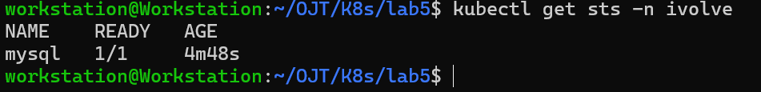

# Kubernetes Lab 5:  StatefulSet with Headless Service

This lab demonstrates how to work with Kubernetes `StatefulSet` and `Headless Service`.

----------

## Tasks Overview

- Create a StatefulSet with 1 replica running MySQL.
- Configure the StatefulSet pods to consume the root password from the secret.
- Add a toleration to the StatefulSet pod spec for the taint key node=worker with effect NoSchedule. 
- Configure a Persistent Volume Claim (PVC) and mount it to /var/lib/mysql in the StatefulSet.
- Write a YAML manifest for a headless service (clusterIP: None) targeting the MySQL StatefulSet pods.
- Confirm the database is operational by connecting with a MySQL client.
      
----------

## Steps and Screenshots

### 0. Requisites:
- The namespace `ivolve` already exists and was created in a previous Kubernetes lab (Lab 2).
- The MySQL secret and config already exist and were created in the previous Kubernetes lab (Lab 3).

----------
### 1. Define the Headless Service Manifest
Create a YAML file `mysql-hsvc.yaml` with the following content to create a headless service which is required for `StatefulSet`:
```yaml
apiVersion: v1
kind: Service
metadata:
  name: mysql-service
  namespace: ivolve
spec:
  clusterIP: None
  selector:
    app: mysql
  ports:
    - port: 3306
      name: mysql
``` 
### 2. Define the StatefulSet Manifest
Create a YAML file `mysql-sts.yaml` with the following content:
```yaml
apiVersion: apps/v1
kind: StatefulSet
metadata:
  name: mysql
  namespace: ivolve
spec:
  serviceName: mysql-service
  selector:
    matchLabels:
      app: mysql
  replicas: 1
  template:
    metadata:
      labels:
        app: mysql
    spec:
      tolerations:
        - key: "node"
          operator: "Equal"
          value: "worker"
          effect: "NoSchedule"
      containers:
        - name: mysql
          image: mysql:8.0
          ports:
            - containerPort: 3306
          volumeMounts:
            - name: mysql-data
              mountPath: /var/lib/mysql
          env:
            - name: MYSQL_ROOT_PASSWORD
              valueFrom:
                secretKeyRef:
                  name: mysql-secret
                  key: MYSQL_ROOT_PASSWORD
  volumeClaimTemplates:
    - metadata:
        name: mysql-data
      spec:
        accessModes: ["ReadWriteOnce"]
        resources:
          requests:
            storage: 1Gi
``` 
### 3. Apply the Manifests
We apply the manifests through:
```bash
kubectl apply -f mysql-hsvc.yaml
kubectl apply -f mysql-sts.yaml
```


### 4. Verify
To verify the headless service is created correctly by the following command and `CLUSTER-IP` must be `None`:
```bash
kubectl get svc -n ivolve
```

To verify the `StatefulSet` is created correctly and runs the MySQL replica:
```bash
kubectl get sts -n ivolve
```

To verify that the `PersistentVolumeClaim` associated with our `StatefulSet` replica is created:'
```bash
kubectl get pvc -n ivolve
```

To verify MySQL runs correctly, we exec into our mysql pod `mysql-0`:
```bash
kubectl exec -it mysql-0 -n ivolve -- bash
```


