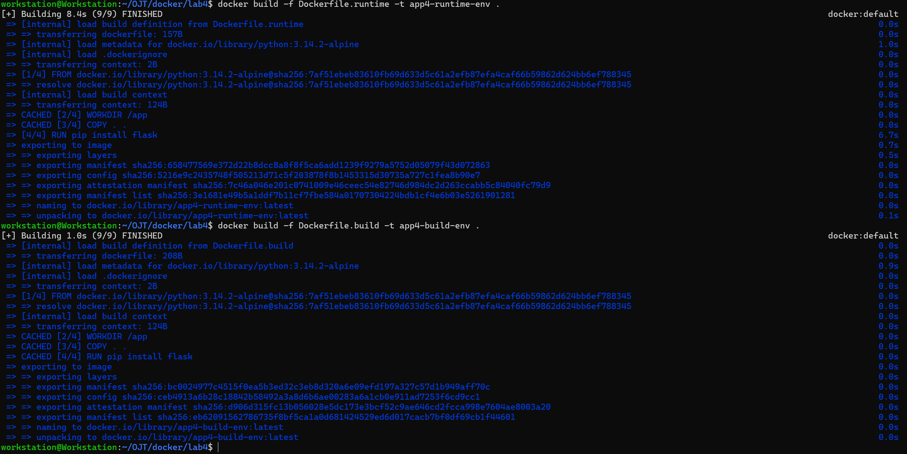
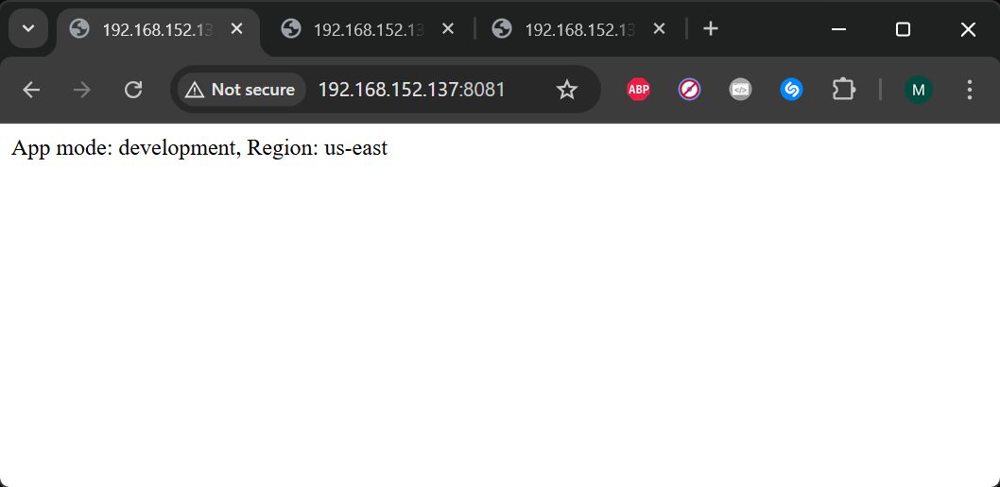
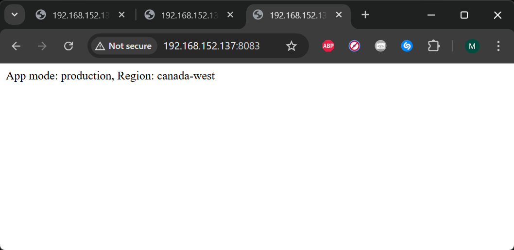

# Docker Lab 4: Managing Docker Environment Variables Across Build and Runtime

This lab demonstrates how to manage Docker environment variables at both build time and runtime using a Python Flask application.  

---

## Tasks Overview

- Clone the Application Code
- Create two Dockerfiles:
  - Runtime environment variables
  - Build-time environment variables
- Build Docker images
- Run containers using different environment variable methods:
  1. Command-line variables
  2. Environment file
  3. Variables defined inside the Dockerfile
---

## Steps and Screenshots

### 1. Clone the Application Code

Clone the repository:

```bash
git clone https://github.com/Ibrahim-Adel15/Docker-3.git lab4
cd lab4
```


---
### 2. Create Dockerfiles (Runtime & Build-Time Environment Variables)

#### 2.1 Dockerfile for Runtime Environment Variables
Create a file named Dockerfile.runtime
```dockerfile
FROM python:3.14.2-alpine

WORKDIR /app
COPY . .

RUN pip install flask

EXPOSE 8080

CMD ["python", "app.py"]
```
#### 2.2 Dockerfile for Build-Time Environment Variables
Create a file named Dockerfile.build
```dockerfile
FROM python:3.14.2-alpine

WORKDIR /app
COPY . .

RUN pip install flask

ENV APP_MODE=production
ENV APP_REGION=canada-west

EXPOSE 8080

CMD ["python", "app.py"]
```
---
### 3. Build Docker Images

```bash
docker build -f Dockerfile.runtime -t app4-runtime-env .
docker build -f Dockerfile.build -t app4-build-env .
```


---
### 4. Running the Containers and Viewing the Application

#### 4.1 (development, us-east) as variables in the command when run docker container
Run the container and pass environment variables directly:
```bash
docker run -d -p 8081:8080 -e APP_MODE=development -e APP_REGION=us-east --name container4-runtime-env1 app4-runtime-env
```


#### 4.2 (staging, us-west) in a separate file and pass the file name in the command
Create an environment file named .env:
```bash
echo -e "APP_MODE=staging\nAPP_REGION=us-west" > .env
```
```INI
APP_MODE=staging
APP_REGION=us-west
```
Run the container using the environment file:
```bash
docker run -d -p 8082:8080 --env-file .env --name container4-runtime-env2 app4-runtime-env
```


#### 4.3 (production, canada-west) in the Dockerfile
Run the container built from the Dockerfile with build-time variables:
```bash
docker run -d -p 8083:8080 --name container4-build-env app4-build-env
```


