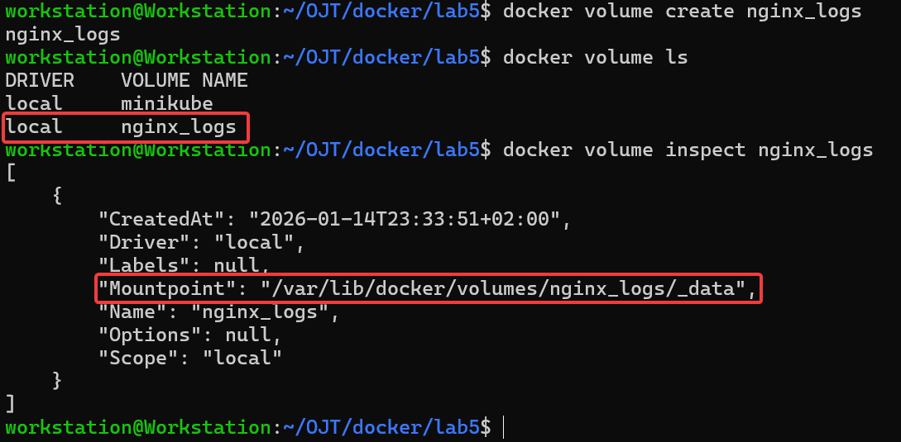
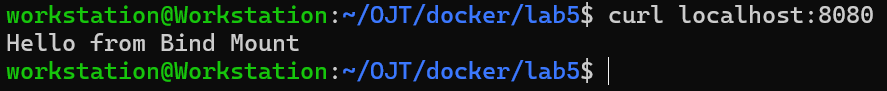

# Docker Lab 5: Managing Docker Environment Variables & Volumes

This lab demonstrates how to use Docker **volumes** to persist data, mount directories, and inspect logs with an Nginx container.

---

## Tasks Overview

- Create nginx_logs volume to persist Nginx logs and verify it in the default 
volumes path.
- Create a directory nginx-bind/html to serve a custom HTML file from your host 
machine.
- Create index.html file with “Hello from Bind Mount” syntax in nginx-bind/html 
directory.
- Run Nginx container with the following:
  - Volume for /var/log/nginx
  - Bind Mount for /usr/share/nginx/html
 - Verify Nginx page by running curl command from your local machine.
 - Change in the index.html file in your local machine then verify Nginx page again.
 - Verify logs are stored in the nginx_logs volume.
 - Delete the volume.
---

## Steps and Screenshots

### 1. Nginx Logs Volume Creation

Clone the repository:

```bash
docker volume create nginx_logs docker volume ls docker volume inspect nginx_logs
```


---
### 2. Prepare the Bind Mount Directory

Create a local directory to serve the custom html from `nginx-bind/html`
```bash
mkdir -p nginx-bind/html
```
Create the `index.html` file inside that directory with the content `Hello from Bind Mount`

```bash
echo "Hello from Bind Mount" > nginx-bind/html/index.html
```

---
### 3. Run A Container with an Nginx Image and the Required Mounts

```bash
docker run -d -p 8080:80 --mount type=volume,source=nginx_logs,target=/var/log/nginx --mount type=bind,source=./nginx-bind/html,target=/usr/share/nginx/html --name container5 nginx
```


---
### 4. Verify the Bind Mount

#### 4.1 Initial Content
Use `curl` to verify that the container is serving the content from our local `nginx-bind/html` directory.
```bash
curl localhost:8080
```


#### 4.2 Content after editing local `index.html`

Modify the local `index.html` file. Since it is bind-mounted, the changes should reflect without restarting the container.

```bash
echo "Hello from Bind Mount After Edit" > nginx-bind/html/index.html
```


### 5. Inspecting the `nginx_logs`  Volume.
```bash
docker run --rm -it --user root --mount type=volume,source=nginx_logs,target=/logs alpine sh
```
Inside the temporary container, you should see the Nginx log files (`access.log`, `error.log`) stored in the volume:
```bash
cd /logs
ls
```


### 6. Delete the `nginx_logs` volume.

To delete the volume, we need to stop and remove all containers that are using it first and then delete them, otherwise we will get an error.
```bash
docker stop container5
docker rm container5
docker volume rm nginx_logs
```


