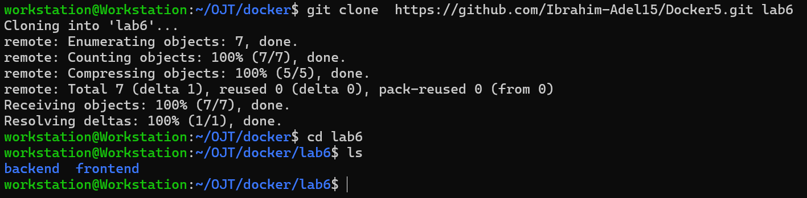
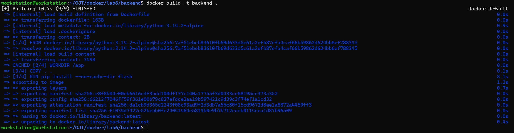
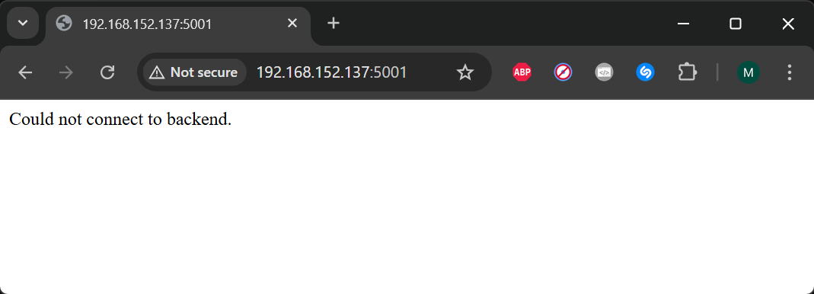

# Docker Lab 6: Custom Docker Network for Microservices

This lab demonstrates how to build and run frontend and backend microservices using Docker, connect containers using a custom Docker network, and verify inter-container communication.

---

## Tasks Overview

-   Clone the frontend and backend Code https://github.com/Ibrahim-Adel15/Docker5.git
-   Write Dockerfile for frontend and create image.
	- Use python image
	- Install packages in requirements.txt file
	- Expose port 5000
	- Run python command on app.py
- Write Dockerfile for backend and create image.
	- Use python image
	- Install flask
	- Expose port 5000
	- Run python command on app.py
-   Create a new network called `ivolve-network`.
-   Run:
    - Backend container using `ivolve-network`.
    - Frontend container (frontend1) using `ivolve-network`.
    - Another frontend container (frontend2) using default network.
-   Verify communication between containers.
-   Delete `ivolve-network`.
---

## Steps and Screenshots

### 1. Clone the Repository

Clone the repository:

```bash
git clone https://github.com/Ibrahim-Adel15/Docker5.git lab6
cd lab6
```


---
### 2. Dockerfiles and Building the Images

#### 2.1 Frontend Dockerfile
Create a `Dockerfile` inside the `frontend` directory:
```bash
cd backend
vim Dockerfile
```
Build the frontend image:


#### 2.2 Backend Dockerfile
Create a `Dockerfile` inside the `backend` directory:
```bash
cd backend
vim Dockerfile
```
Build the backend image:


---
### 3. Create a Custom Docker Network
Create a new Docker bridge network called `ivolve-network`:
```bash
docker network create ivolve-network
```
---
### 4. Running the Required Containers

1. Backend container (backend) with the `ivolve-network` network (backend)
2. Frontend container  (frontend1) with the `ivolve-network` network
3. Frontend container  (frontend2) with the default network

```bash
docker run -d --name backend --network ivolve-network backend
docker run -d --name frontend1 --network ivolve-network -p 5000:5000 frontend
docker run -d --name frontend2 -p 5001:5000 frontend
```


---
### 5. Verifying Communication Between Containers

#### 5.1 Network Inspection
Inspect the `ivolve-network` network to verify connected containers:
```bash
docker network inspect ivolve-network --format '{{ range $key, $value := .Containers }}{{printf "%s: %s\n" $key .Name}}{{ end }}'
```


#### 5.2 Ping Test Between Containers

Ping the backend container by name through the frontend containers to test correct communication.

```
docker exec frontend1 ping backend -c 3
docker exec frontend2 ping backend -c 3
```
 


#### 5.3 Browser Verification

 - frontend1 (ivolve-network network)

 - frontend2 (default network)


---
### 6. Delete the `ivolve-network` Network
Before deleting the network, stop and remove all related containers:
```bash
docker stop frontend1 backend
docker rm frontend1 backend
```
Delete the network:
```bash
docker network rm ivolve-network
```
Verify deletion:
```bash
docker network ls
```

