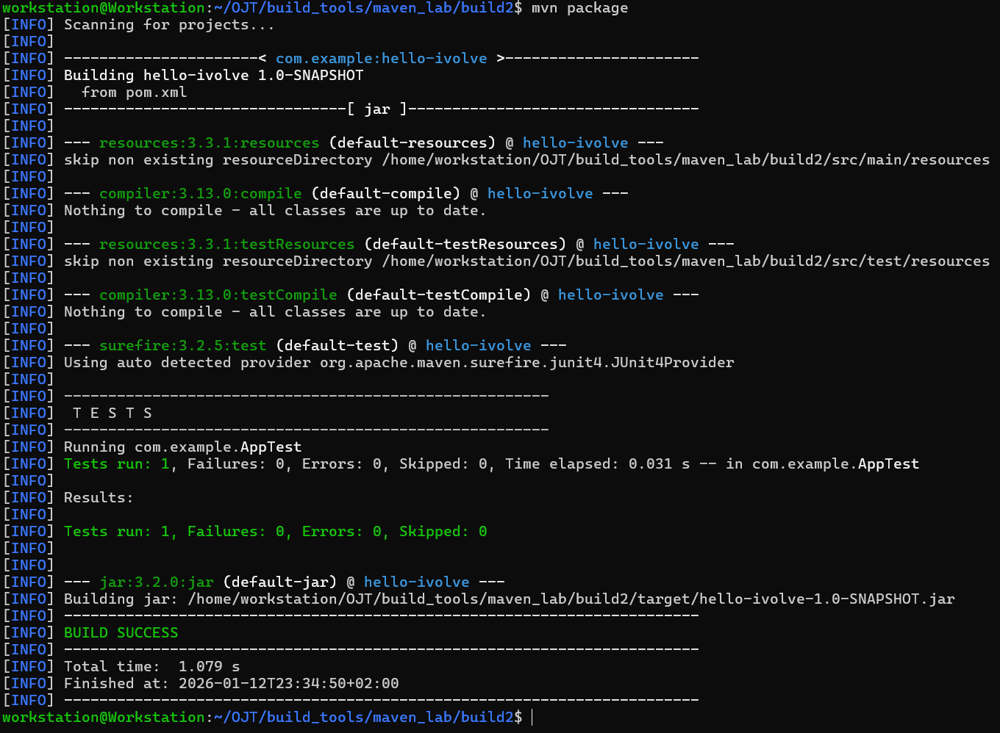

# Lab 2: Building and Packaging Java Applications with Maven

This lab demonstrates building and packaging a Java application using Maven, running unit tests, generating a build artifact, and running the application.

---

## Tasks Overview

    1. Install Maven.
    2. Clone the source code: https://github.com/Ibrahim-Adel15/build2.git
    3. Run unit tests.
    4. Build the application to generate the JAR artifact (`target/hello-ivolve-1.0-SNAPSHOT.jar`).
    5. Run the application.
    6. Verify the application is working.

---

## Steps and Screenshots

### 1. Installing Maven

#### 1.1 Install Maven
```bash
sudo apt update
sudo apt install maven -y
```
#### 1.2 Verify Maven Installation
```bash
mvn -v
```


### 2. Clone the Application Repository
```bash
git clone https://github.com/Ibrahim-Adel15/build2.git
cd build2/
```


### 3. Run Unit Tests
```bash
mvn test
```


### 4. Build the Application
```bash
mvn package
```


### 5. Run the Application
```bash
java -jar target/hello-ivolve-1.0-SNAPSHOT.jar
```
